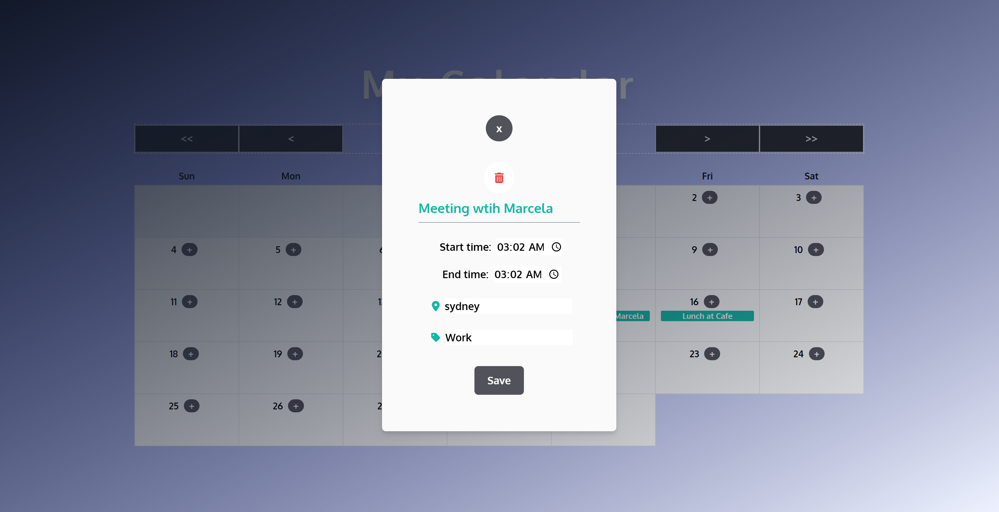

# Events Calendar

💻 Backend: [Click here!](https://github.com/marcelamejiao/Events-Creator-API)

## **Table of Contents**

- [**Table of Contents**](#table-of-contents)
- [**Description**](#description)
- [**My experience**](#my-experience)
- [**Usage**](#usage)
- [**Technologies Used**](#technologies-used)
- [**Preview**](#preview)
- [**Deployed link**](#deployed-link)
- [**Future Development**](#future-development)
- [**Questions**](#questions)

## **Description**

This project was designed to create a web application where a calendar is displayed showing the current month and a grid
of days.

* Each of the days cells is clickable.
* When a user click on a chosen day, a modal appears (empty for now).
* The user is able to navigate between months, view the upcoming month and previous month.
* The user is able to navigate between years, view the upcoming year and previous year.

This application consists of a React Typescript frontend.

## **My experience**

This was the first time that I used the date utility library date-fns. I found this library easy to understand and very
useful to implement functions and be able to get specific dates.

Writing code with TS still a bit challenging but it is definitely better than the firts time, it has been a process of
reading and practice.

This was also the first time that I used Tailwind for styling in a personal project and I found Tailwind a great source
to style an application, as it can summarize multiple lines of code and also it was very easy to find its documentation
and implement it.

## **Usage**

```
npm install 
```

```
npm run dev 
```

## **Technologies Used**

* React
* Typescript
* Tailwind
* Date-fns

## **Preview**

* **Calendar**


* **Modal**



## **Deployed link**

💡 Live version: [Click here!](https://events-calendar.apps.marcelamejia.xyz/)

## **Future Development**

* DONE: This project is the base of two following projects where the fronted and backend implementation were be develop.
* DONE: The styling will be update once the following projects are finished.
* Implement calendar events that span multiple days.
* Mobile view.
* Filter by Label.

## **Questions**

* Contact me on my GitHub profile: [Marcela's GitHub](https://github.com/marcelamejiao)
